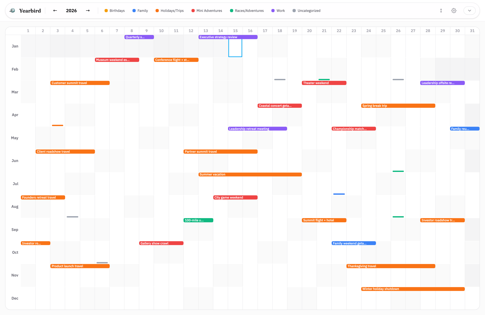
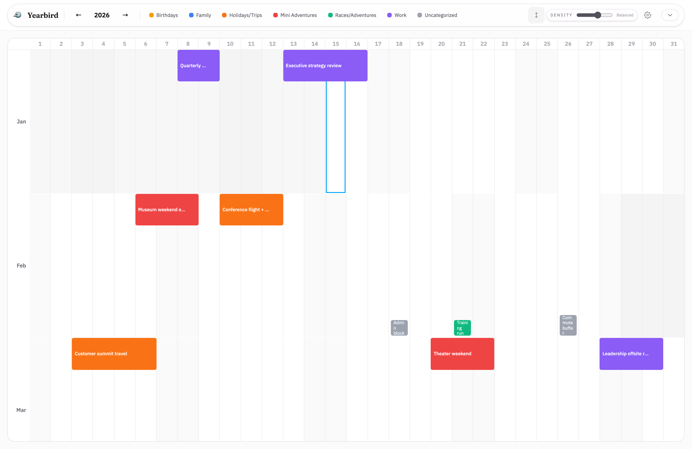
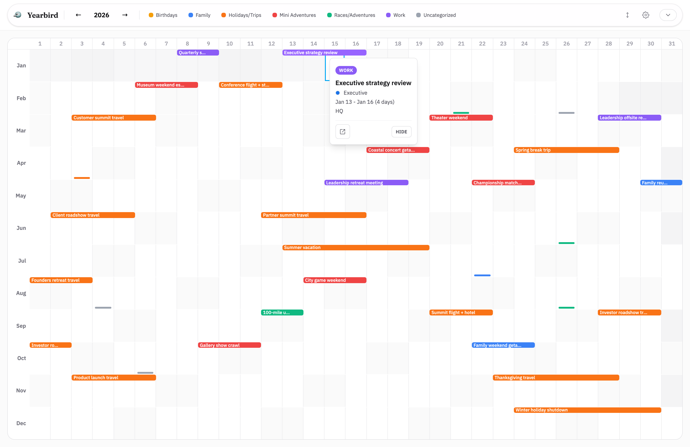
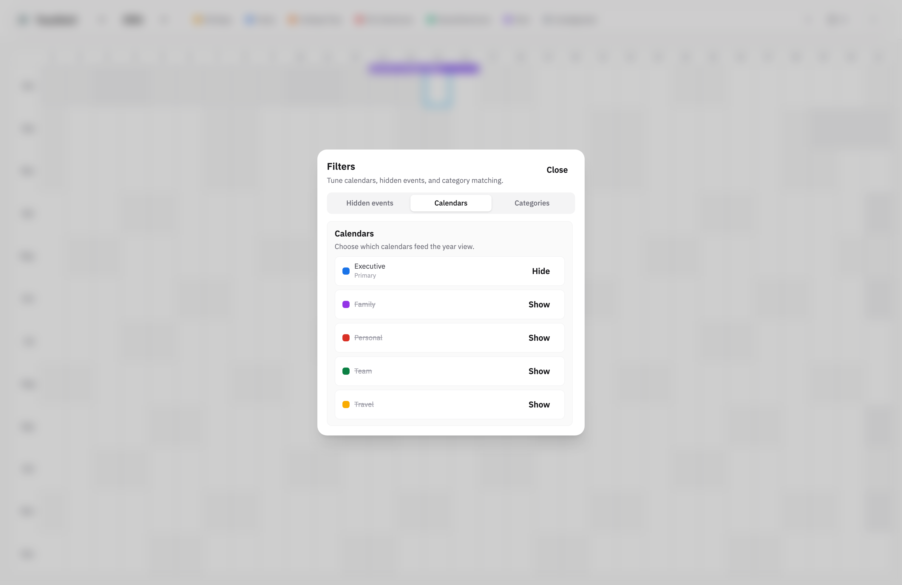
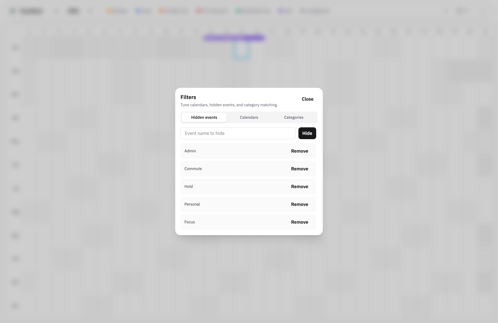
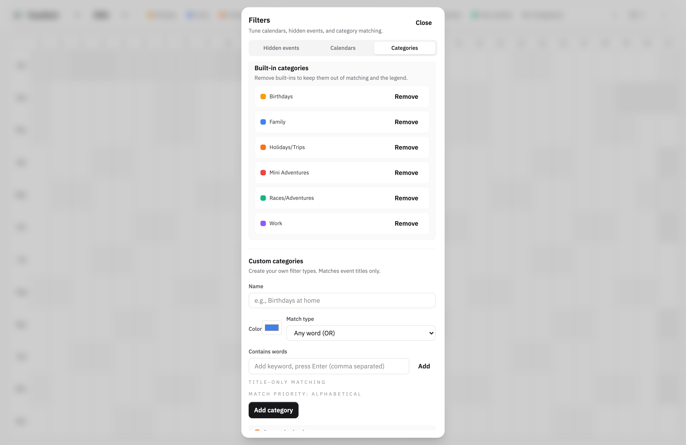

# Yearbird

> A bird's-eye view of your year. See your entire Google Calendar on one screen.

[](https://github.com/mjaverto/yearbird/actions/workflows/deploy.yml)
[](https://opensource.org/licenses/MIT)

## What is Yearbird?

Yearbird is a year-at-a-glance calendar visualization that syncs with your Google Calendar. See all 365 days on one screen with color-coded events, making it easy to spot patterns, plan ahead, and understand how you spend your time.

**[Live demo →](https://yearbird.com)**

## Features

- **365-day view** — See your entire year at once, no scrolling
- **Google Calendar sync** — Connects to your calendar with read-only access
- **Color-coded categories** — Events auto-categorized by type (work, travel, family, etc.)
- **Multi-day events** — Trips and projects shown as horizontal bars
- **Privacy-first** — Your data never leaves your browser, client-side only
- **Free & open source** — Host it yourself or use our Github hosted version

## Screenshots

<table>
  <tr>
    <td align="center">
      <a href="docs/screenshots/readme/year-grid.png">
        
      </a>
      <br />
      <sub>Year-at-a-glance grid</sub>
    </td>
    <td align="center">
      <a href="docs/screenshots/readme/month-scroll.png">
        
      </a>
      <br />
      <sub>Month-focused scroll mode</sub>
    </td>
  </tr>
  <tr>
    <td align="center">
      <a href="docs/screenshots/readme/vertical-expanded.png">
        
      </a>
      <br />
      <sub>Vertical expanded mode</sub>
    </td>
    <td align="center">
      <a href="docs/screenshots/readme/event-tooltip.png">
        
      </a>
      <br />
      <sub>Event detail on hover</sub>
    </td>
  </tr>
  <tr>
    <td align="center">
      <a href="docs/screenshots/readme/filters-calendars.png">
        
      </a>
      <br />
      <sub>Pick active calendars</sub>
    </td>
    <td align="center">
      <a href="docs/screenshots/readme/filters-hidden.png">
        
      </a>
      <br />
      <sub>Hide noise with filters</sub>
    </td>
  </tr>
  <tr>
    <td align="center" colspan="2">
      <a href="docs/screenshots/readme/filters-categories.png">
        
      </a>
      <br />
      <sub>Fine-tune categories</sub>
    </td>
  </tr>
</table>

## Quick Start

### Use the hosted version

1. Go to [yearbird.com](https://yearbird.com)
2. Click "Sign in with Google"
3. See your year!

### Run locally

```bash
git clone https://github.com/mjaverto/yearbird.git
cd yearbird
npm install
npm run dev
```

Open [http://localhost:5173/yearbird/](http://localhost:5173/yearbird/)

## Testing

```bash
npm run lint
npm run typecheck
npm run test
npm run test:ci
```

## Documentation

- [Local Development Setup](./docs/SETUP.md)
- [Google OAuth Configuration](./docs/GOOGLE_OAUTH.md)
- [Deployment Guide](./docs/DEPLOYMENT.md)
- [Architecture Overview](./docs/ARCHITECTURE.md)

## Tech Stack

- **Vite** + **React 18** + **TypeScript**
- **Tailwind CSS v4** + **Catalyst UI Kit**
- **Google Identity Services** (client-side OAuth)
- **Google Calendar API v3**
- **GitHub Pages** (static hosting)

## Color Categories

Events are auto-categorized by keywords in their titles:

| Color | Category | Example Keywords |
|-------|----------|------------------|
| 🟣 Purple | Work | meeting, call, 1:1, sync |
| 🟢 Green | Races/Adventures | race, marathon, hike |
| 🟡 Yellow | Birthdays | birthday, bday |
| 🟠 Orange | Holidays/Trips | flight, hotel, vacation |
| 🔴 Red | Mini Adventures | reservation, concert |
| 🔵 Blue | Family | family, kids, anniversary |
| ⚪ Gray | Uncategorized | everything else |

## Contributing

Contributions are welcome! Please check the [issues](https://github.com/mjaverto/yearbird/issues) for things to work on.


## License

MIT License — see [LICENSE](./LICENSE) for details.
